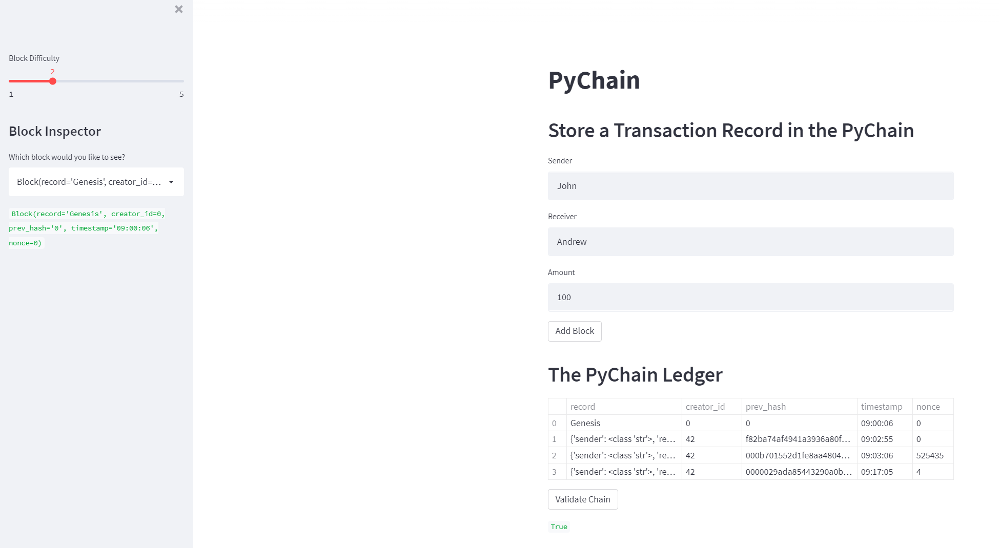

# Fintech-Blockchain - Pychain

## Overiew 

In this repo is a blockchain developed using visual studio code and launched using streamlit.

Within the Code folder there is a .py file that details the blockchain 

## Summary

### Mined Block

### Validiated Block - True

